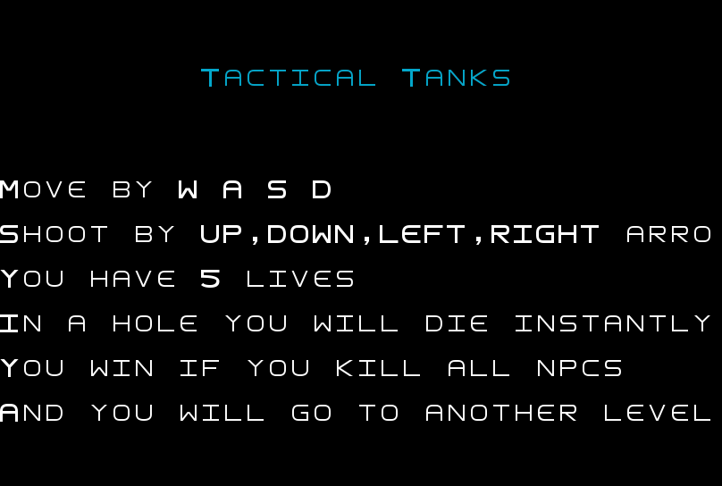
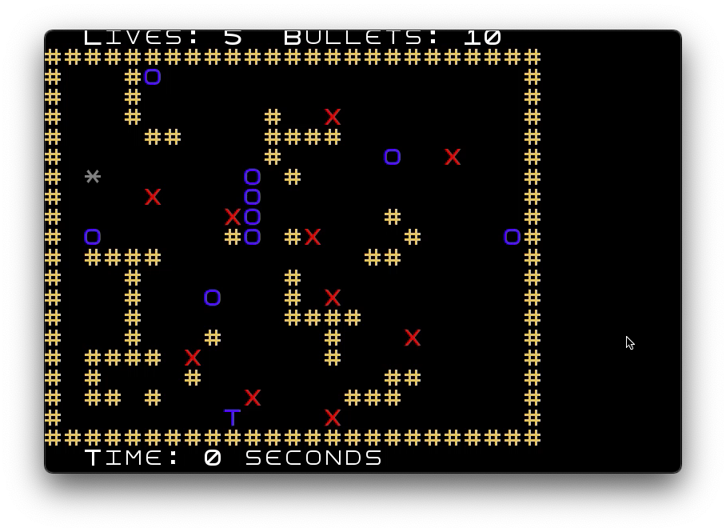

# LDTS_T14_G06 - Tactical Tanks

## Game Description

Os jogadores controlam um tanque pelo mapa (usando as teclas direcionais) e controlam para que direção querem disparar (usando as teclas wasd) com o objetivo de derrotar tanques inimigos, que serão npcs automatizados e ao mesmo tempo fugir dos disparos dos mesmos.

Os jogadores terão ainda de contornar obstáculos ou usá-los estrategicamente como escudo. Os obstáculos são buracos no chão e caixas, sendo que as balas podem passar por cima dos buracos mas não por entre as caixas. Os tanques não podem passar por nenhum desses dois.

Se as balas ou do jogador ou do inimigo chocarem contra os limites do mapa, contra as caixas, ou contra os tanques, rebentam. Se a bala do jogador chocar com a bala no inimigo, as duas rebentarão.

No final de eliminar todos os inimigos, o jogador passa para o nível seguinte. O objetivo é progredir pelos diferentes níveis, cada um introduzindo novos mapas e mais difíceis tanques inimigos. A dificuldade de uns níveis será o número muito reduzido de balas, de outros o limite de tempo, de outros o número de tanques inimígos e de outros a combinação de todas estas dificuldades.

O jogador não poderá retornar a jogar a partir do último nível a que conseguiu chegar. Se um jogador perder num nível terá de retornar ao nível 1. No menu aparecerá o recorde (nível máximo alcançado).

Para uma versão mais detalhada da descrição do jogo clica aqui:[here](./docs/README.md).

## Screenshots

Aqui estão alguns screenshots e gifs do jogo e respetivas descrições.

### Menu

  

  <b><i>Fig 1. Menu principal </i></b>

  

 
 

  

  <b><i>Fig 2. A opção "Rules" mostra as instruções de jogo </i></b>  

  

 
 

  

  <b><i>Fig 3. High scores dos jogadores por ordem de melhor classificação </i></b>

 
 

### Níveis

  

  <b><i>Fig 4. Nível 1 </i></b>

 
 

  

  <b><i>Fig 5. Nível 2 </i></b>

### Animações

  

  <b><i>Gif 1. Tanque do jogador a cair num buraco </i></b>

 
 

  

  <b><i>Gif 2. Tanque do jogador a perder uma vida </i></b>

 
 

  

  <b><i>Gif 3. Tanque do jogador a carregar balas </i></b>

 
 

### Fim do jogo

  

  <b><i>Gif 4. Tanque do jogador a eliminar o último inimigo do nível 1 e a passar para o nível seguinte </i></b>

  

  <b><i>Fig 6. Mensagem de Game Over</i></b>

 
 