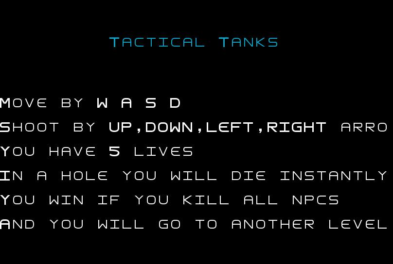
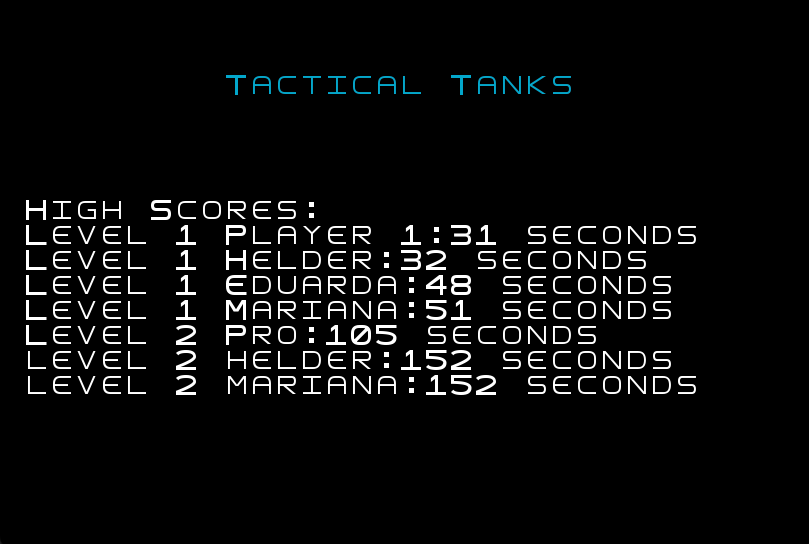
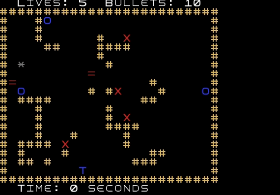
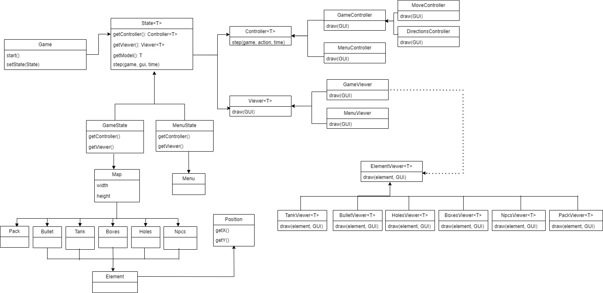

## LDTS_T14_G06 - Tactical Tanks

## Game Description

No jogo ao qual demos o nome de Tactical Tanks, os jogadores controlam um tanque pelo mapa (usando as teclas direcionais) e controlam para que direção querem disparar (usando as teclas wasd) com o objetivo de derrotar tanques inimigos, que serão npcs automatizados e ao mesmo tempo fugir dos disparos dos mesmos. 

Os jogadores terão ainda de contornar obstáculos ou usá-los estrategicamente como escudo. Os obstáculos são buracos no chão e caixas, sendo que as balas podem passar por cima dos buracos mas não por entre as caixas. Os tanques não podem passar por nenhum desses dois.

Se as balas ou do jogador ou do inimigo chocarem contra os limites do mapa, contra as caixas, ou contra os tanques, rebentam. Se a bala do jogador chocar com a bala no inimigo, as duas rebentarão.

No final de eliminar todos os inimigos, o jogador passa para o nível seguinte. O objetivo é progredir pelos diferentes níveis, cada um introduzindo novos mapas e mais difíceis tanques inimigos. A dificuldade de uns níveis será o número muito reduzido de balas, de outros o limite de tempo, de outros o número de tanques inimígos e de outros a combinação de todas estas dificuldades.

O jogador não poderá retornar a jogar a partir do último nível a que conseguiu chegar. Se um jogador perder num nível terá de retornar ao nível 1. No menu aparecer1á o recorde (nível máximo alcançado).

This project was developed by Afonso Campelo Poças (up202008323@fe.up.pt), Ana Catarina Patrício (up202107383@fe.up.pt) e Mariana de Sá Melo (up202207877@fe.up.pt) no âmbito da UC de LDTS 1º sem 2023-24.

### IMPLEMENTED FEATURES

- **Menu** - O menu apresenta os seguintes tópicos:
                                                    PLAY
                                                    RULES
                                                    RECORDS
                                                    EXIT

 
 

  

  <b><i>Fig 1. Menu principal </i></b>

  

 
 

  

  <b><i>Fig 2. A opção "Rules" mostra as instruções de jogo </i></b>  

  

 
 

  

  <b><i>Fig 3. High scores dos jogadores por ordem de melhor classificação </i></b>

 
 

- **Mover** - O tanque do utilizador (representado por um T) move-se no mapa através das teclas direcionais (↑↓←→)

- **Disparar** - Pode-se disparar em 4 direções diferentes usando as teclas wasd: para cima (w), para baixo (s), para a esquerda (a) e para a direita (d)

- **Caixas** - As caixas (representadas por um =) são usadas de acordo com a estratégia escolhida pelo jogador. Nem o tanque nem as balas passam por entre as caixas, mas ao final de serem atingidas 3 vezes, as caixas quebram. O jogador pode escolher usar a caixa como escudo ou quebrá-la e libertar caminho.

- **Buracos** - O jogador não pode passar pelos buracos (representados por um O). Se neles cair, é game over.

 
 

  

  <b><i>Gif 1. Tanque do jogador a cair num buraco </i></b>

 
 

- **Paredes** - Nem as balas, nem os npcs, nem o jogador são capazes de passar pelas paredes (representadas por um #). As paredes são inquebráveis.

- **Inimigos (npcs)** - Os inimigos (representados por um X) são npcs que se movem continuamente em direção ao jogador. Se tocarem no jogador, o jogador perde uma vida. Quando o jogador ficar sem vidas é game over.

 
 

  

  <b><i>Gif 2. Tanque do jogador a perder por ficar sem vidas </i></b>

 
 

- **Contador de tempo** - No canto inferior esquerdo do mapa existe um contador de tempo crescente em formato de relógio digital.

- **Níveis** - Quando o jogador matar todos os tanques inimigos, passa para o próximo nível. Existem 2 níveis, sendo que o segundo é mais dificil que o anterior.

- **Número inicial de balas e packs para repor as balas** - O jogador começa com um um número de balas de acordo com o nível em que se encontra. Se as balas acabarem e o jogador ainda não tiver cumprido o objetivo de eliminar todos os npcs do mapa, terá de as repor passando pelos packs (representados por um *).Aparecerá de forma random no mapa.

 
 

  

  <b><i>Gif 3. Tanque do jogador a carregar balas </i></b>

 
 

- **Packs de balas de quantidades diferentes** - Existem dois tipos de packs: os de cor cinza e os de cor amarela. Os cinza recarregam somente 1 bala enquanto que os amarelos recarregam 3 balas de uma vez. Estes aparecem alternadamente aleatoriamente pelo mapa. Ora cinza, ora amarelo.

- **Ecrã de Game Over** - Este é o ecrã que indica ao jogador que o jogo terminou (Game Over) e o encaminha para o menu principal.

 
 

  

  <b><i>Fig 4. Mensagem de Game Over</i></b>

 
 

### PLANNED FEATURES

- **Tempo limite** - Tínhamos pensado em definir um tempo limite para finalizar um nível em níveis mais avançados. Por outras palavras, o jogador deixaria de ter tempo ilimitado para eliminar os tanques inimigos e haveria um contador de tempo fora do limite do mapa como o contador que implementamos, mas este seria decrescente. Quando chegasse a 00:00, seria Game Over.
Decidimos não avançar com esta ideia pois a principal dificuldade do jogo está em repor as balas e em fugir dos tanques inimigos. Para além disso, a tabela de recordes apresenta as tentativas que correspondem a um menor tempo de jogo para finalizar o nível, pelo que esta feature não faria por isso sentido.

- **Número de disparos limite** - Tínhamos idealizado definir um número de balas limite muito reduzido  para finalizar um nível em níveis mais avançados. O jogador não poderia repor o número de balas a meio do jogo, ou seja, deixariam de aparecer os packs de balas pelo mapa. Concluímos que não seria boa ideia porque o nível ficaria excessivamente dificil.

As features mais importantes para dinamizar o jogo foram implementadas com sucesso e por isso não achamos ter perdido em não ter implementado estas duas features.

## Design

### Estrutura geral - organização

 
 

  

  <b><i>Fig 5. Esquema UML </i></b>

 
 

#### Problem in Context:
Como o nosso jogo usa Graphical User Interface, contém varios gameStates e várias features, decidimos usar alguns dos patterns que viemos a estudar ao longo do semestre. Assim, desenvolveríamos o jogo da forma mais eficiente possível: uma estrutura simples e organizada.

#### The Pattern:
Escolhemos usar o **_State Pattern_**. Essa abordagem utiliza subclasses para representar cada estado, sendo por isso mais fácil mudar de estado. Fica tudo encapsulado numa única classe e usa-se o Single Responsibility Principle e Open/Closed Principle.

A principal razão para esta escolha foi a necessidade de lidar com as mudanças de estado dos objetos. O State Pattern permite a desvinculação das transições de estado do algoritmo principal. Dá-nos ainda a liberdade de criar novos estados mais facilmente à medida que desenvolvemos o jogo se necessário.

#### Implementation:
No que diz respeito à implementação, agora temos classes cujo principal propósito é armazenar dados (model), classes que controlam a lógica do jogo (controllers) e classes que são responsáveis pelos efeitos visuais na tela (viewers). 

#### Consequences:
A utilização deste pattern proporciona os seguintes benefícios:

- Os diversos estados que representam os diferentes menus tornam-se explícitos no código, em vez de dependerem de uma série de flags.
- Um código bem organizado que respeita o Single Responsibility Principle.
- Facilidade para adicionar novos recursos ao longo do desenvolvimento do jogo.

### Observers and listeners
#### Problem in Context:  
É usado o teclado para receber o input do jogador. Existem várias maneiras de receber entrada desses dispositivos. Para isso decidimos recorrer aos Observers and Listeners, que são responsáveis por receber a entrada mencionada e redistribuí-la de uma maneira mais inteligente e tornando o programa mais eficiente.

#### The Pattern:
Usamos o **_Observer pattern_**. Estabelece uma dependência de um-para-muitos entre objetos de modo que, quando um objeto muda de estado, todos os seus dependentes são notificados e atualizados automaticamente. Encapsula os componentes centrais (ou comuns ou do motor) em uma abstração de Subject, e os componentes variáveis (ou opcionais ou de interface do usuário) em uma hierarquia de Observer. Essa abordagem representa a parte "View" do Model-View-Controller.

#### Implementation:
O padrão Observer é um padrão de design que define uma relação de um-para-muitos entre objetos, de modo que quando um objeto "observável" muda de estado, todos os seus dependentes (os "observadores") são notificados e atualizados automaticamente.

#### Consequences:
De uma forma sussinta, o Observer pattern permite o seguinte:
- O single responsibility principle.
- Código mais organizado
- Apenas o estado atual do jogo é notificado quando uma entrada é fornecida.

### MapBuilder e LoaderMapBuilder
#### Problem in Context:
Temos como features as paredes, os buracos, as caixas, etc. São bastantes os elementos com uma posição fixa no mapa, portanto, seria preciso um construtor para cada nível. Nestas situações o que faz mais sentido fazer é criar um LoaderMapbuilder dos mapas que lêm e inserem na super classe (Map builder) os elementos todos. Essa implementação faz com que seja possível distinguir a construção de um objeto com imensos elementos da sua representação, de modo a que o mesmo processo de construção possa gerar representações diferentes.

#### The Pattern:
Tal como indiretamente mencionado em cima, o design pattern escolhido são **_Factory Method_** pois permite criar subclasses, nomeadamente, os elementos do jogo e o **_Builder_** para gerar os vários mapas.

#### Implementation:
O MapBuilder é responsável por contruir com os elementos (subclasses), ou seja, paredes, buracos, etc.
Podemos reumir o Factory Method ao método de criar uma superclasse especifica todo comportamento padrão e genérico (usando "placeholders"), e depois delega os detalhes da criação para subclasses.

Links para as classes:
- [MapBuilder](../src/main/java/org/example/model/game/map/MapBuilder.java)
- [LoaderMapBuilder](../src/main/java/org/example/model/game/map/LoaderMapBuilder.java)

#### Consequences:
Estas são as principais vantagens dos dois design pattens:
- O Builder é útil para quando é necessário construir objetos complexos passo a passo. Ele permite a criação de diferentes representações do mesmo objeto.
- Pode haver diferentes builders para criar objetos com características específicas, mantendo a mesma estrutura de construção.
- Open/Closed Principle. Fica mais fácil fazer alterações à medida que desenvolvemos o jogo
- Quando ao Factory method, este é útil para quando a criação de objetos é delegada para subclasses. Cada subclasse pode fornecer uma implementação específica.
- Facilita a extensão, permitindo que novas subclasses da fábrica sejam introduzidas sem modificar o código existente.

## Known-code smells

Não encontramos nada que pudesse comprometer o nosso código.

## Testing

### Screenshot of coverage report

  

  <b><i>Fig 6. Code coverage screenshot</i></b>

### Link to mutation testing report
[Mutation tests](../reports/tests/test/index.html)

### SELF-EVALUATION

Julgamos que os 3 integrantes trabalharam de igual modo para concretizar este projeto. Distribuímos tarefas pelos 3 e mantivemos uma boa comunicação desde início até ao fim. Tivemos também a oportunidade de aplicar de forma prática os conhecimentos teóricos que viemos a estudar ao longo do semestre.
Posto isto, aqui estão as percentagens:

- Afonso Campelo Poças: (100/3)%
- Ana Catarina Patrício: (100/3)%
- Mariana de Sá Melo: (100/3)%
